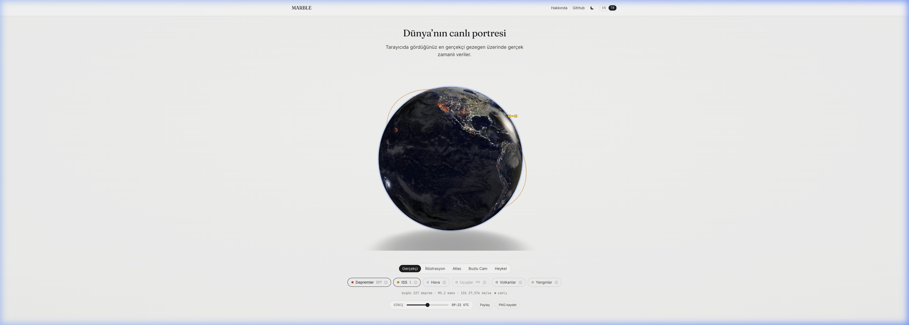
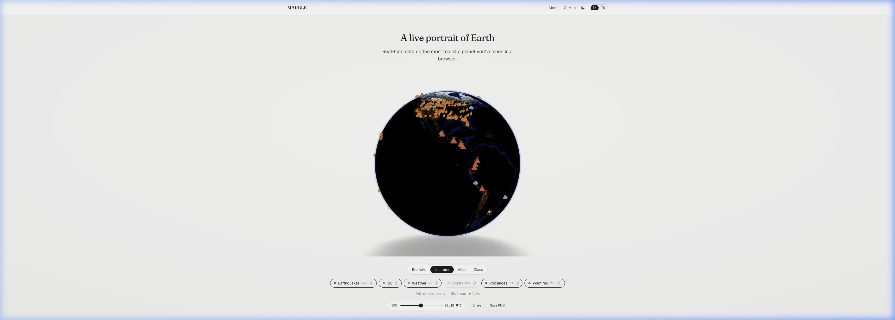
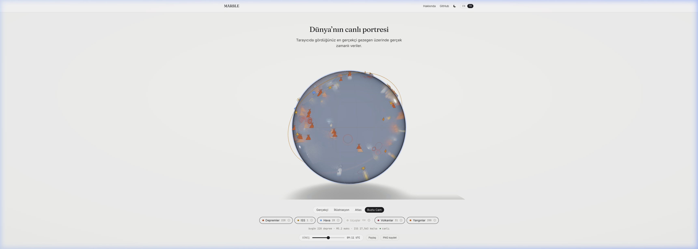
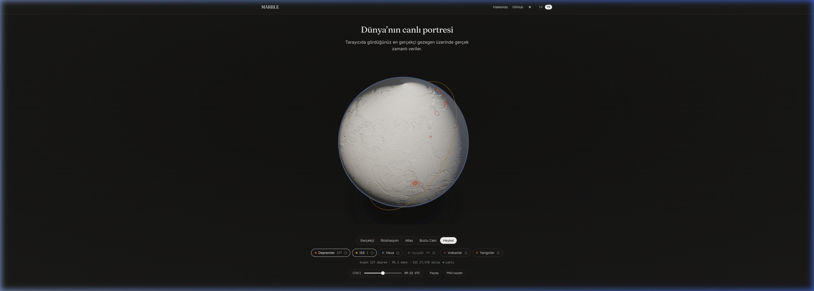
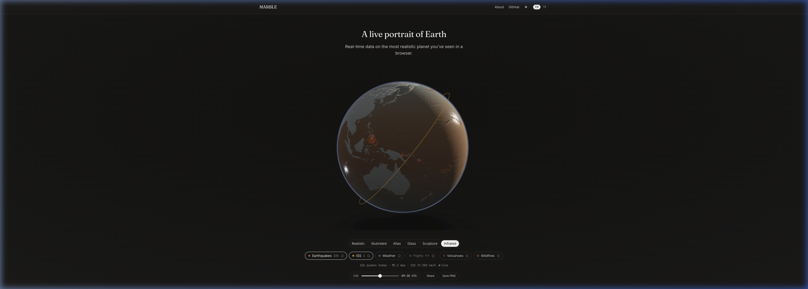
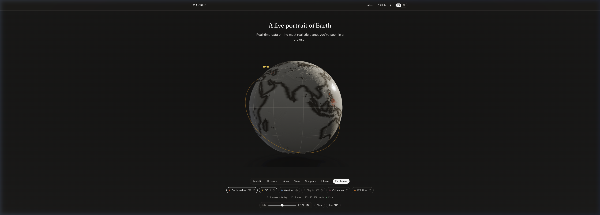
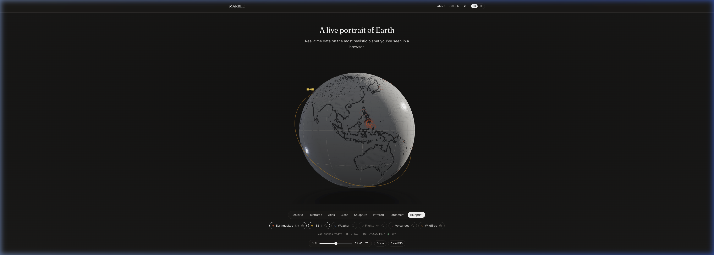

<div align="center">

<br />


<br /><br />

```text
███╗   ███╗  █████╗ ██████╗ ██████╗ ██╗     ███████╗
████╗ ████║██╔══██╗██╔══██╗██╔══██╗██║     ██╔════╝
██╔████╔██║███████║██████╔╝██████╔╝██║     █████╗
██║╚██╔╝██║██╔══██║██╔══██╗██╔══██╗██║     ██╔══╝
██║ ╚═╝ ██║██║  ██║██║  ██║██████╔╝███████╗███████╗
╚═╝     ╚═╝╚═╝  ╚═╝╚═╝  ╚═╝╚═════╝ ╚══════╝╚══════╝
```

### **A live portrait of Earth.** — The planet, as a museum piece.

[**◆ Live Demo →**](https://marble-drab-delta.vercel.app)

</div>

---

## ✦ What is MARBLE?

**MARBLE** is a hyper-realistic, slowly rotating Earth presented on a clean, editorial-light
landing page — the planet rendered as a museum piece rather than a sci-fi dashboard. NASA
imagery, custom PBR shading, a real-time solar terminator, and a separate cloud layer make
it hard to tell whether you are looking at a render or a photograph.

On top of that surface, MARBLE draws the world as it happens: **earthquakes, the
International Space Station, city weather, volcanoes, wildfires, and flights** — each layer
rendered as its own recognizable, animated visual rather than a generic dot. Click anything
to open a rich, museum-style information panel.

Eight distinct rendering styles let you see the same planet through radically different
artistic lenses — from NASA satellite photography to 17th-century cartography.

---

<details>
<summary><strong>🇹🇷 Türkçe Açıklama</strong></summary>

<br />

**MARBLE**, temiz ve editoryal-aydınlık bir landing page üzerinde sunulan, yavaşça dönen
hiper-gerçekçi bir Dünya'dır — gezegen, bir bilim-kurgu paneli değil, bir müze parçası gibi
işlenmiştir. NASA görüntüleri, özel PBR gölgeleme, gerçek zamanlı gündoğumu/günbatımı çizgisi
ve ayrı bir bulut katmanı; render mı yoksa fotoğraf mı olduğunu ayırt etmeyi zorlaştırır.

Bu yüzeyin üzerine MARBLE, dünyayı olduğu gibi çizer: **depremler, Uluslararası Uzay
İstasyonu, şehir hava durumu, volkanlar, yangınlar ve uçuşlar** — her katman jenerik bir
nokta yerine kendine özgü, animasyonlu bir görsel olarak işlenir. Herhangi bir nesneye
tıklayarak zengin, müze tarzı bir bilgi paneli açın.

Sekiz farklı render stili aynı gezegenin radikale farklı sanatsal merceklarle görülmesini sağlar.

</details>

---

## 🌍 Globe Gallery

Eight handcrafted rendering styles — switch between them instantly with a single click.

<br />

### 🛰️ Realistic
*NASA Blue Marble + Black Marble city lights, PBR shading, real-time day/night terminator*



---

### 🎨 Illustrated
*Cel-shaded, hand-painted aesthetic with stylized ocean and land colours*



---

### 💎 Glass / Crystal
*Frosted glass and crystal transmission material — semi-transparent with physical refraction*



---

### 🏛️ Sculpture
*Travertine plaster — single-colour matte material revealing topography through light and shadow only*



---

### 🌡️ Infrared Biosphere
*Artistic heatmap palette inspired by NASA SST / chlorophyll data — terracotta, sage, charcoal*



---

### 🗺️ Parchment / Antique Map
*17th-century cartographic style — aged parchment, sepia ink coastlines, engraved ocean textures*



---

### 📐 Blueprint / Wireframe
*Architectural schematic — warm-gray contour lines and dot-matrix landmasses on paper-white*



---

## ⚡ Features

| Feature | Description |
|---------|-------------|
| 🌍 **8 Globe Styles** | Realistic · Illustrated · Atlas · Glass · Sculpture · Infrared · Parchment · Blueprint — switch instantly |
| 🛰️ **Hyper-realistic Earth** | NASA Blue Marble albedo, relief & roughness maps, Black Marble city lights, animated clouds, and atmosphere under studio lighting |
| 🌗 **Real-time terminator** | Day/night line computed from the actual date & time, with a draggable sun scrubber to sweep it across the globe |
| 📡 **Living data layers** | Earthquakes, ISS, weather, volcanoes, wildfires, flights — each with its own visual language, not dots |
| 🛰️ **ISS orbital tracking** | Spacecraft sprite + always-visible orbit tube + live trail of where it has been |
| 🌊 **Seismic wavefronts** | Earthquakes render as expanding waves scaled by magnitude — M2 and M8 never look alike |
| 🪟 **Museum info panels** | Click any object for enriched stats, Wikipedia imagery, ISS crew, magnitude context, nearest city, and source attribution |
| 🌓 **Light & dark · TR/EN** | Editorial light and dark themes, full Turkish/English localization |
| 🔗 **Share & export** | Shareable view URLs (style + layers + sun) and one-click PNG capture |

---

## 🎨 Globe Style Technical Details

| Style | Material | Key Technique |
|-------|----------|---------------|
| **Realistic** | `MeshStandardMaterial` + custom GLSL | Blue Marble albedo, PBR roughness split, Black Marble night lights |
| **Illustrated** | `MeshToonMaterial` + custom shader | Cel-shading with stylized palette and contour edges |
| **Atlas** | `MeshStandardMaterial` | Classic cartographic colours, political boundaries |
| **Glass** | `MeshPhysicalMaterial` | `transmission`, `roughness` mask, physical refraction |
| **Sculpture** | `MeshStandardMaterial` | No albedo — pure normal map depth + strong AO, warm plaster tone |
| **Infrared** | Custom fragment shader | Artistic SST/chlorophyll palette (terracotta → sage → charcoal) |
| **Parchment** | `MeshStandardMaterial` + canvas texture | Aged parchment albedo, sepia normal ink, engraved ocean pattern |
| **Blueprint** | Custom vertex/fragment shader | Procedural contour lines from elevation map, warm-gray ink on paper-white |

---

## 🛠️ Tech Stack

```text
Framework   →  Next.js 14 (App Router) · TypeScript (strict)
3D Engine   →  Three.js · React Three Fiber · @react-three/drei · custom GLSL
Styling     →  Tailwind CSS v3 · CSS variables (editorial light/dark)
State       →  Zustand · Animation → Framer Motion
Data        →  USGS · wheretheiss.at · Open-Meteo · NASA EONET · OpenSky · Wikipedia
Imagery     →  NASA Blue Marble & Black Marble (public domain)
Fonts       →  Fraunces (display) · Inter (UI) · JetBrains Mono (data)
Deploy      →  Vercel
```

---

## 📐 Project Structure

```text
Marble/
├── app/
│   ├── layout.tsx            # fonts, metadata, JSON-LD, theme bootstrap
│   ├── page.tsx              # landing page composition
│   ├── globals.css           # design tokens (light/dark), radial background
│   └── api/                  # cached proxy routes (earthquakes, iss, weather,
│                             #   volcanoes, fires, flights, crew)
├── components/
│   ├── earth/                # Globe.tsx orchestrator + per-style components:
│   │   ├── EarthRealistic.tsx   #   NASA PBR + GLSL day/night
│   │   ├── EarthIllustrated.tsx #   cel-shaded toon
│   │   ├── EarthAtlas.tsx       #   cartographic
│   │   ├── EarthGlass.tsx       #   crystal transmission
│   │   ├── EarthSculpture.tsx   #   plaster normal-map
│   │   ├── EarthInfrared.tsx    #   heatmap shader
│   │   ├── EarthParchment.tsx   #   antique parchment
│   │   └── EarthBlueprint.tsx   #   wireframe schematic
│   ├── layers/               # IconLayer, SeismicLayer, ISSLayer, FocusPlume
│   ├── landing/              # Nav, Hero, pills, stats, scrubber, actions, footer
│   ├── ui/                   # InfoPanel
│   ├── motion/ · providers/  # reveals, data poller, share sync
├── lib/
│   ├── geo/ · data/ · panel/ # math, sources/normalize, panel models
│   ├── textures/ · icons/    # texture loader, SVG icon atlas
│   └── i18n/ · utils/        # dictionary (TR/EN), helpers
├── store/                    # Zustand stores (globe, layers, data, ui, …)
├── public/
│   ├── textures/             # optimized NASA maps (committed)
│   └── screenshots/          # globe style preview images
├── scripts/                  # fetch-textures, make-og
└── docs/                     # specs · plans · research
```

---

## 🚀 Getting Started

### Prerequisites

- Node.js `>= 18`
- [`pnpm`](https://pnpm.io)

### Local Development

```bash
# Clone the repository
git clone https://github.com/kutluhangil/Marble.git
cd Marble

# Install dependencies
pnpm install

# (Optional) refresh the NASA Earth textures — committed already
pnpm textures

# Start the dev server
pnpm dev
```

App runs at `http://localhost:3000`.

### Environment

All layers work without configuration except flights, which needs OpenSky credentials:

```bash
OPENSKY_CLIENT_ID=
OPENSKY_CLIENT_SECRET=
NEXT_PUBLIC_SITE_URL=http://localhost:3000
```

---

## 🛰 Data Sources

| Layer | Source | Auth |
|-------|--------|------|
| Earthquakes | USGS Earthquake Hazards Program | none |
| ISS position · crew | wheretheiss.at · Open-Notify | none |
| City weather | Open-Meteo | none |
| Volcanoes · Wildfires | NASA EONET | none |
| Flights | OpenSky Network | OAuth2 (optional) |
| Place imagery & facts | Wikipedia REST | none |

---

## 🔬 The Realism Breakdown

The **Realistic** globe uses a `MeshStandardMaterial` extended via `onBeforeCompile`: Blue Marble albedo,
normal-mapped relief, a roughness split (reflective oceans / matte land), Black Marble city
lights gated to the night side by the real-time sun, ocean sun-glint, cloud shadows, a
separate animated cloud shell, and a delicate daylight atmosphere — all under 3-point studio
lighting with ACES tone mapping.

The **Glass** globe uses `MeshPhysicalMaterial` with full transmission, chromatic aberration,
and a roughness mask to separate crystalline oceans from frosted-glass landmasses.

The **Sculpture** globe removes all albedo and relies purely on high-depth normal maps and
ambient occlusion to reveal mountain ranges (Andes, Himalayas) through chiaroscuro lighting alone.

The **Infrared** globe uses a custom fragment shader that maps terrain elevation and biome
data through an artistic colour ramp — terracotta orange → sage green → coal grey —
inspired by NASA SST and chlorophyll satellite imagery.

The **Parchment** and **Blueprint** globes use procedural GLSL to generate aged parchment
grain and architectural contour lines respectively, without any pre-baked textures.

---

## 🗺️ Roadmap

- [x] Hyper-realistic Earth — day/night, clouds, atmosphere, studio lighting
- [x] Real-time data layers with per-layer visual identity
- [x] ISS orbital tracking · seismic wavefronts · weather/volcano/fire icons
- [x] Globe styles (8 total) · light/dark · TR/EN · time scrubber
- [x] Universal info panels with Wikipedia enrichment
- [x] Shareable URLs · PNG export · Vercel deploy
- [x] Glass · Sculpture · Infrared · Parchment · Blueprint styles
- [ ] Aurora oval (NOAA SWPC)
- [ ] EONET expansion — storms, dust, floods, sea ice, drought
- [ ] Air quality layer (Open-Meteo)
- [ ] Live satellites / Starlink (CelesTrak)

---

## 📄 License

MIT — see [LICENSE](LICENSE). Fork it, learn from it, build your own planet.

---

<div align="center">

A live portrait of Earth, built with care.

<br />

*If you find this useful, consider giving it a ⭐*

</div>
